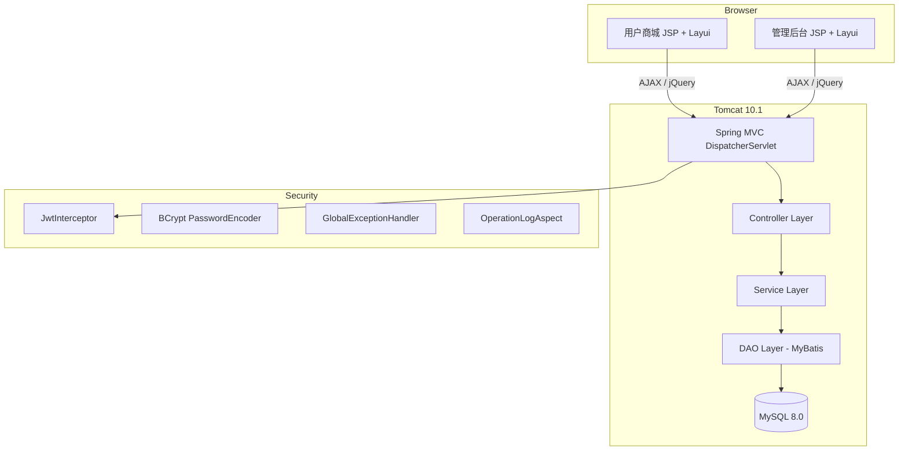
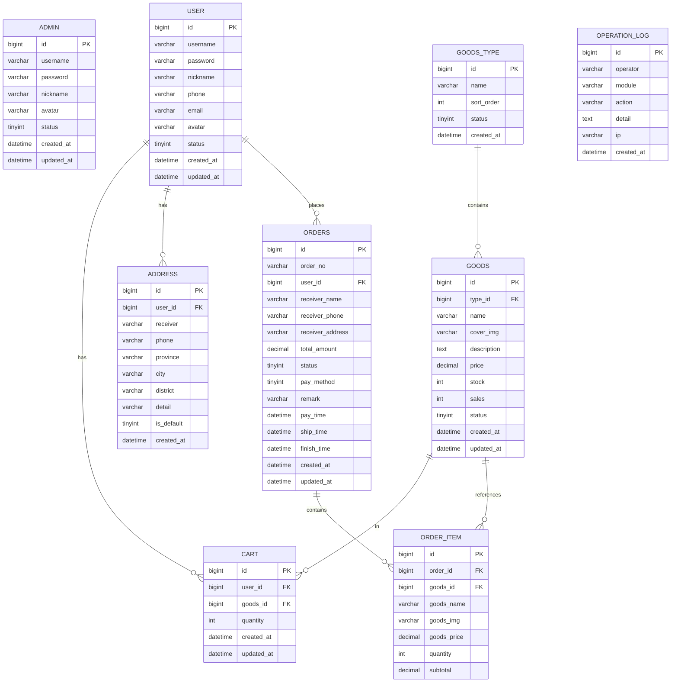

# 农产品销售系统 - 项目设计文档

## 1. 系统架构

## 2. 技术栈

| 层次 | 技术 |
|------|------|
| 前端 | JSP + Layui 2.9 + jQuery |
| 控制层 | Spring MVC 6.1 |
| 业务层 | Spring 6.1 (IoC + AOP + 事务) |
| 持久层 | MyBatis 3.5 + 手写XML映射 |
| 数据库 | MySQL 8.0 + HikariCP |
| 安全 | JWT (jjwt 0.12) + BCrypt |
| 部署 | Tomcat 10.1 + Docker Compose |

## 3. ER 图

## 4. 接口清单

### AuthController (认证)
| Method | Path | Description |
|--------|------|-------------|
| POST | /api/auth/login | 用户登录 |
| POST | /api/auth/register | 用户注册 |
| POST | /api/auth/admin/login | 管理员登录 |
| GET | /api/auth/info | 获取当前用户信息 |

### GoodsController (商品)
| Method | Path | Description |
|--------|------|-------------|
| GET | /api/goods/list | 分页查询商品 |
| GET | /api/goods/detail | 商品详情 |
| GET | /api/goods/search | 搜索商品 |
| POST | /api/goods | 新增商品(管理员) |
| PUT | /api/goods/{id} | 更新商品(管理员) |
| DELETE | /api/goods/{id} | 删除商品(管理员) |

### GoodsTypeController (分类)
| Method | Path | Description |
|--------|------|-------------|
| GET | /api/goods-type/list | 分类列表 |
| POST | /api/goods-type | 新增分类 |
| PUT | /api/goods-type/{id} | 更新分类 |
| DELETE | /api/goods-type/{id} | 删除分类 |

### CartController (购物车)
| Method | Path | Description |
|--------|------|-------------|
| GET | /api/cart/list | 购物车列表 |
| POST | /api/cart | 加入购物车 |
| PUT | /api/cart/{id} | 修改数量 |
| DELETE | /api/cart/{id} | 删除商品 |
| DELETE | /api/cart/clear | 清空购物车 |

### OrderController (订单)
| Method | Path | Description |
|--------|------|-------------|
| POST | /api/order | 创建订单 |
| GET | /api/order/list | 订单列表 |
| GET | /api/order/{id} | 订单详情 |
| PUT | /api/order/{id}/cancel | 取消订单 |
| PUT | /api/order/{id}/pay | 支付订单 |
| PUT | /api/order/{id}/confirm | 确认收货 |
| PUT | /api/order/{id}/ship | 发货(管理员) |

### AddressController (收货地址)
| Method | Path | Description |
|--------|------|-------------|
| GET | /api/address/list | 地址列表 |
| POST | /api/address | 新增地址 |
| PUT | /api/address/{id} | 更新地址 |
| DELETE | /api/address/{id} | 删除地址 |

### AdminController (管理)
| Method | Path | Description |
|--------|------|-------------|
| GET | /api/admin/dashboard | 仪表盘数据 |
| GET | /api/admin/users | 用户管理列表 |
| PUT | /api/admin/user/{id}/status | 启用/禁用用户 |
| GET | /api/admin/orders | 订单管理列表 |
| GET | /api/admin/logs | 操作日志 |

## 5. 页面清单

### 用户端
| 页面 | URL | 说明 |
|------|-----|------|
| 首页 | / | 商品列表、分类筛选、搜索、分页 |
| 商品详情 | /goods-detail?id=x | 商品信息、加入购物车 |
| 购物车 | /cart | 购物车列表、全选、修改数量、结算 |
| 确认订单 | /checkout | 选择地址、提交订单 |
| 我的订单 | /orders | 订单列表、Tab切换状态、支付/取消/确认收货 |
| 收货地址 | /address | 地址CRUD、设置默认 |
| 登录 | /login | 用户登录 |
| 注册 | /register | 用户注册（含表单验证） |

### 管理端
| 页面 | URL | 说明 |
|------|-----|------|
| 管理员登录 | /admin/login | 管理员登录 |
| 管理后台 | /admin | iframe布局 + 侧边栏导航 |
| 仪表盘 | /admin/dashboard | 统计卡片 |
| 商品管理 | /admin/goods | 商品CRUD + 搜索 + 分页 |
| 分类管理 | /admin/goods-type | 分类CRUD |
| 订单管理 | /admin/orders | 订单列表 + 发货 + 详情 |
| 用户管理 | /admin/users | 用户列表 + 启用/禁用 |
| 操作日志 | /admin/logs | 日志列表 + 分页 |

## 6. UI/UX 规范

| 属性 | 值 |
|------|-----|
| 主色调 | #67C23A (农产品绿) |
| 辅助色 | #E6A23C (丰收金) |
| 背景色 | #F5F7FA |
| 卡片背景 | #FFFFFF |
| 文字主色 | #303133 |
| 文字次色 | #909399 |
| 圆角 | 8px |
| 卡片阴影 | 0 2px 12px rgba(0,0,0,0.08) |
| UI框架 | Layui 2.9.8 (CDN) |
